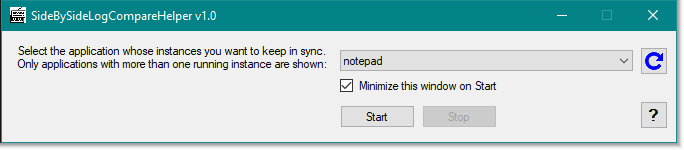

# SideBySideLogCompareHelper

Author: Joseph Ryan Ries 2018 <ryanries09@gmail.com> <ryan.ries@microsoft.com>

The primary goal of SideBySideLogCompareHelper is to assist in analyzing log and trace
files when you want to compare two or more of the files side-by-side. This is done
by essentially mirroring your keyboard input to each separate instance of the desired
application, be it Notepad, Process Monitor, TextAnalysisTool.NET, or practically any
other desktop application. So when your focus is in one Notepad window, and you press
the down arrow, the down arrow will also be pressed in every other instance of Notepad
that you currently have open.

The reason I wrote this app is because I often find myself comparing two debug traces
or log files side-by-side, one from a "working" scenario and one from a "broken" scenario.
I like to get both log files lined up and start comparing them to see where they begin
to diverge. That is often an effective step in troubleshooting an issue.

*****************

The interface is simple:

When the app first starts, it scans all running processes on the system and finds the ones
that meet the following criteria:

- The process is in the same session as you.

- There is more than one instance of the process running.

- The process has a "main window," as determined by the .NET Process object.
  This helps weed out background processes that don't have windows such as svchost, 
  conhost, etc.
  

You can hit the blue "Refresh" button to refresh the list of processes in the drop-down list.

When you hit the Start button, keyboard input will begin being mirrored across every instance
of the process you have open.

The main limitation of this app right now is that you can't type too quickly or things will
get out of sync. Be slow and deliberate for best results.